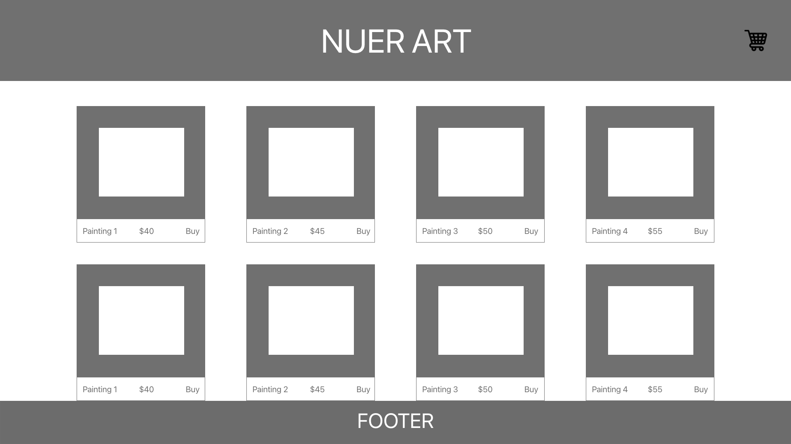
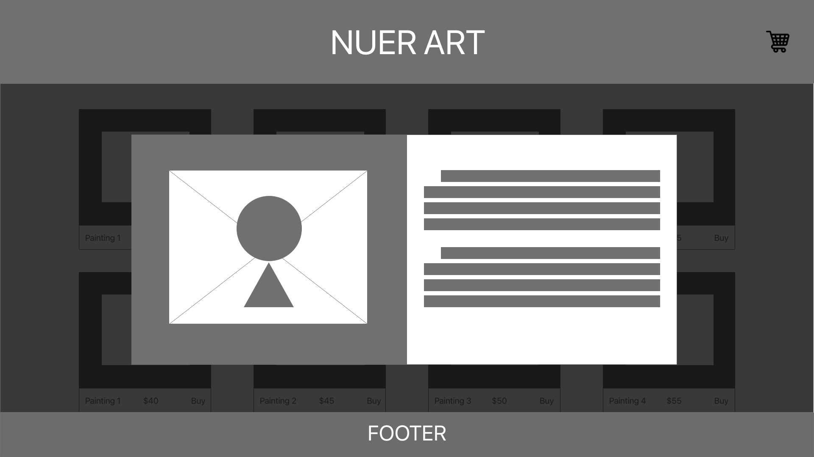
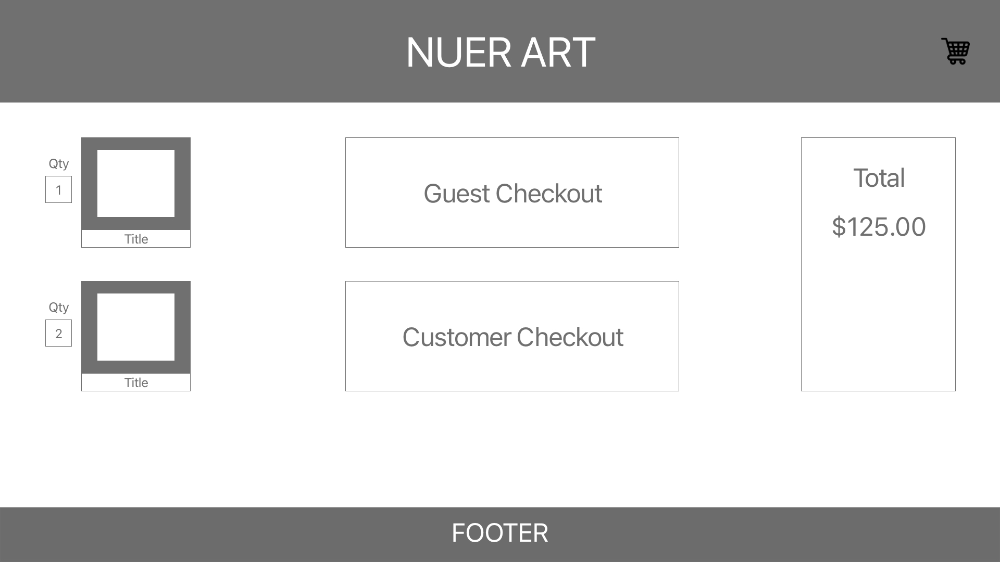
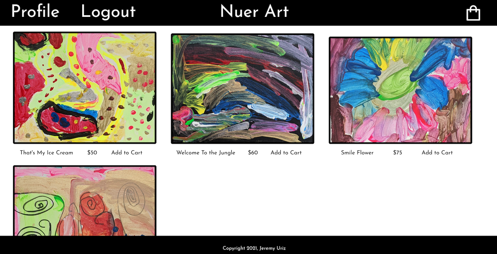
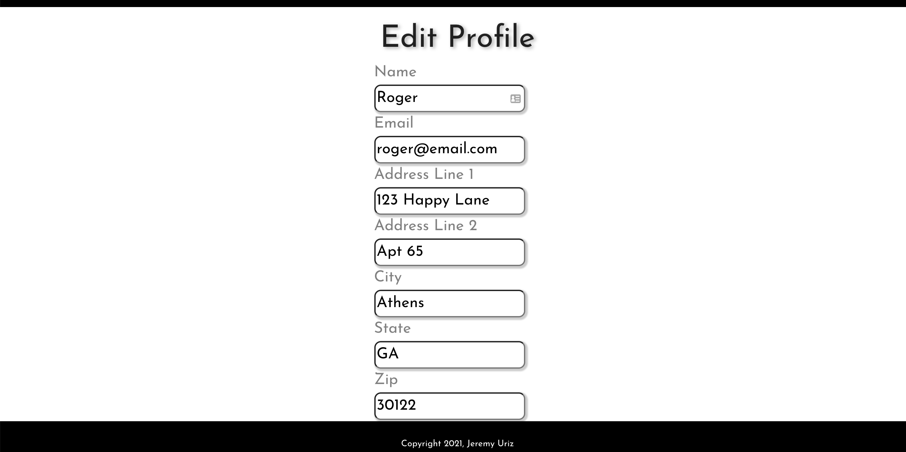
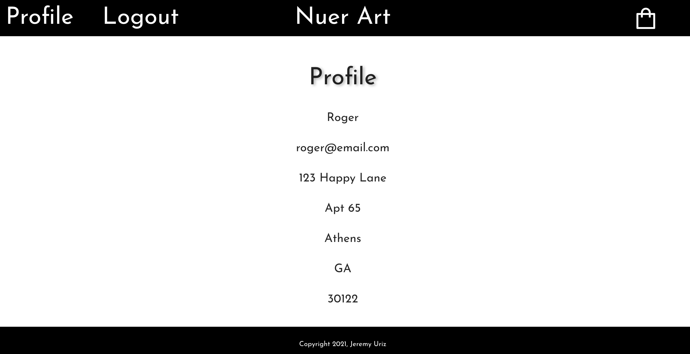
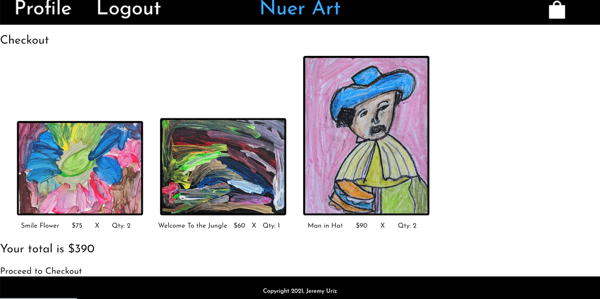

# NuerArt Frontend

This is the frontend repository for the NuerArt site. It was designed to work with the app's [backend repository](https://github.com/JJURIZ/nuer-art-backend). To view the sitev go to [NuerArt](https://nuerart.herokuapp.com/).

**Contents**

1. [About](https://github.com/jtreeves/budget-frontend#about)
2. [Installation](https://github.com/jtreeves/budget-frontend#installation)
3. [Explanation](https://github.com/jtreeves/budget-frontend#explanation)
4. [User Stories](https://github.com/jtreeves/budget-frontend#user-stories)
5. [Dependencies](https://github.com/jtreeves/budget-frontend#dependencies)
6. [Designs](https://github.com/jtreeves/budget-frontend#designs)
7. [Views](https://github.com/jtreeves/budget-frontend#views)
8. [Code Examples](https://github.com/jtreeves/budget-frontend#code-examples)
9. [Stretch Goals](https://github.com/jtreeves/budget-frontend#stretch-goals)

## About

NuerArt was designed as an eCommerce stie to sell my daughter's awesome childhood artwork. 

## Installation

### Create Local Repositories

1. Fork and clone this repository and the corresponding [backend repository](https://github.com/JJURIZ/nuer-art-backend) to your local computer (I recommend storing both directories in a common NuerArt folder)
2. Run `npm i` to install all necessary dependencies
3. Set up a `.env` file to hold the `REACT_APP_SERVER_URL`.

### Set Up Local Database

1. Ensure you have MongoDB installed on your local computer by typing `mongo` into your terminal to launch the Mongo shell (install MongoDB if necessary)
2. Upon running the backend repo (see next step), a new database named `kaleidoscope` should automatically appear in your local MongoDB (confirm by typing `show dbs` while in the Mongo shell)

### Run Locally

1. Run `npm start` from within both the backend directory and the frontend directory
2. View the live version of the site at `http://localhost:3000` in the browser of your choosing

Alternatively, you may view the live site [NuerArt](https://nuerart.herokuapp.com/).

## Explanation

A MERN application was required for the final Software Engineering Immersive project. I chose to build a basic eCommerce site. In order to make it interesting I used my daughter's artwork to setup a faux gallery where prints of her work can be purchased. 

## User Stories

- As a potential user, I want to create an account so I can purchase NuerArt artwork.
- As a new user, I want to see all avaialable artwork so that I may purchase them. 
- As a user, I want to see the total of all the items I've added to my cart.
- As a user, I want to edit my personal information. 


## Dependencies

- ant designs
- axios
- dotenv
- jwt-decode
- react
- react-alert
- react-alert-template-basic
- react-dom
- react-router-dom

## Designs

**Main Page**


**Image Detail**


**Check Out**


## Views

**Main Page**


**Edit Profile**


**Profile**


**Checkout**



## Code Examples

**Send data to the backend**
```javascript
   const handleSubmit = (e) => {
        e.preventDefault();
        if (password !== confirmPassword) {
            alert.show("Password and Confirm Password must match")
        }
        if (name.length < 1 || email.length < 1){
            alert.show("Name and Email are required")
        }

        if (password === confirmPassword) {
            const newUser = { 
                name, 
                email, 
                password, 
                addressLine1, 
                addressLine2, 
                city, 
                state, 
                zip
            }
            axios.post(`${backendUrl}/users/signup`, newUser)
            .then(response => {
                setRedirect(true)
            })
            .catch(error => {
                console.log(error)
            })
        }
    }
```


**Use Sass for advanced styling functionality**
```scss
@mixin titles {
    font-size: 3rem;
    align-self: center;
    text-shadow: 3px 2px 6px darkgrey;
}

@mixin from-container {
    font-size: 1.5rem;
    margin: .5rem 0 .5rem 0;
    width: 300px;
    padding: 0 20px 0 20px;
    border: black;
    border-radius: 10px;
    color: #808080;
}

@mixin form-inputs {
    border-radius: 10px;
    -webkit-box-shadow: 2px 2px 2px 2px #ccc; 
    -moz-box-shadow:    2px 2px 2px 2px #ccc;  
    box-shadow:         2px 2px 2px 2px #ccc;
    color: black;
    &-hover{
        background: linear-gradient(90deg, rgba(182,182,236,1) 44%, rgba(0,212,255,0.4556197478991597) 90%);
    }
}

@mixin header-item-style {
    grid-row-start: 1;
    color: white;
    display: flex;
    align-items: center;
}
```

## Stretch Goals

- Ability to increase/decrease quantity of items from cart. 
- Ability to checkout as a guest.
- Enhance overall site style. 
- Ability to add multiple of the same item to the cart from the gallery. 
